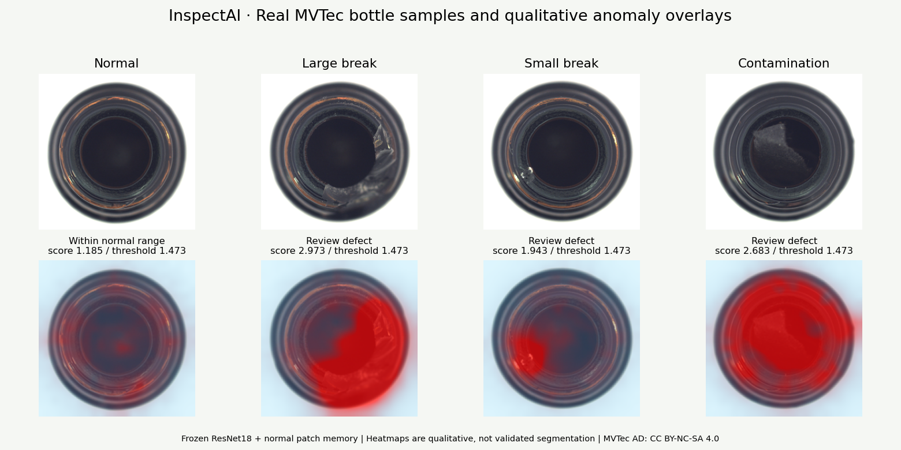

# InspectAI

**AI-powered property inspections from a simple walkthrough video.**

Upload a video, and InspectAI finds the defects, flags structural issues, and gives you a localized repair cost estimate. Built for property managers, restoration teams, and real estate pros who are tired of slow, manual inspection reports.

[Live Demo](https://your-vercel-url.vercel.app) · [Report a Bug](https://github.com/vivekghodekar001/InspectAI/issues) · [Request a Feature](https://github.com/vivekghodekar001/InspectAI/issues)

---

## Preview



## What it does

- **Video analysis:** Gemini vision models go through your walkthrough footage frame by frame.
- **Defect mapping:** Cracks, water damage, mold, and other visible issues are detected and tagged.
- **Structural anomaly detection:** Flags things that need a closer look from a professional.
- **Cost estimation:** Repair estimates adjusted to your local market.
- **Saved inspections:** Sign in with Google and come back to past reports anytime.

## Tech stack

| Layer | Technology |
|---|---|
| Frontend | React 19 + Vite, hosted on Vercel |
| Backend | Node.js + Express, hosted on Render |
| AI | Google Gemini (vision) |
| Storage | Cloudflare R2 (S3-compatible) |
| Database & Auth | Firebase (Firestore + Google OAuth) |

## How it's built

```
Browser (React SPA on Vercel)
   │
   ├── Google sign-in ───────────► Firebase Auth
   ├── Inspection data ──────────► Firestore
   ├── Video upload (presigned) ─► Cloudflare R2   (goes straight from browser, skips the server)
   └── Analysis request ─────────► Express API (Render) ─► Gemini
```

Large videos never pass through the backend. The browser uploads them directly to R2 using presigned URLs, so uploads stay fast and the server stays light. The backend only handles the heavy AI processing and secure URL signing.

## Getting started

### Prerequisites

- Node.js 18+
- A Firebase project (Auth + Firestore enabled)
- A Cloudflare R2 bucket
- A Google Gemini API key

### 1. Clone the repo

```bash
git clone https://github.com/vivekghodekar001/InspectAI.git
cd InspectAI
```

### 2. Set up the backend

```bash
cd server
npm install
cp .env.example .env
```

Fill in `.env`:

```env
GEMINI_API_KEY=your_gemini_key
R2_ACCOUNT_ID=your_r2_account_id
R2_ACCESS_KEY_ID=your_r2_access_key
R2_SECRET_ACCESS_KEY=your_r2_secret
R2_BUCKET_NAME=your_bucket_name
FIREBASE_SERVICE_ACCOUNT=your_service_account_json
```

```bash
npm run dev
```

### 3. Set up the frontend

```bash
cd client
npm install
cp .env.example .env
```

```env
VITE_API_URL=http://localhost:5000
# plus your Firebase web config (VITE_FIREBASE_*)
```

```bash
npm run dev
```

> Folder names and env variables above are placeholders. Adjust them to match your actual project structure.

## Deployment

1. **Firebase:** Create a project, enable Google sign-in, create a Firestore database, and add your web app config.
2. **Cloudflare R2:** Create a bucket, generate API credentials, and set a CORS policy that allows your frontend origin to `PUT` files.
3. **Render (backend):** Connect the repo, set the root directory to the server folder, add the environment variables, and deploy.
4. **Vercel (frontend):** Import the repo, set `VITE_API_URL` to your Render URL, and deploy.

## Roadmap

- [ ] PDF export for inspection reports
- [ ] Side-by-side comparison of inspections over time
- [ ] Multi-user teams and shared workspaces
- [ ] Mobile-friendly capture flow

## Contributing

Contributions are welcome.

1. Fork the repo
2. Create a branch: `git checkout -b feature/your-feature`
3. Commit your changes: `git commit -m "Add your feature"`
4. Push and open a Pull Request

## License

Distributed under the MIT License. See `LICENSE` for details.

## Author

**Vivek Ghodekar**
GitHub: [@vivekghodekar001](https://github.com/vivekghodekar001)
